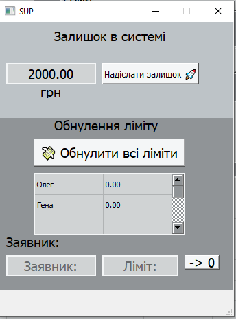

[ ] створити кнопку адмін панелі у фласк застосунку:
    - відкривається вікно чи сторінка де
        
        там є поле, в яке менеджер вводить системну суму
        після натискає кнопку "надіслати" та викидається повідомлення в телеграм

    
повідомлення залишку: в телеграм виводиться повідомлення залишку
обнулити всі ліміти: в бд ліміти обнуляються та виводиться повідомлення, що адміністратор обнулив усі ліміти та всі гроші плюсуються в загальний ліміт
обнулити ліміт: в бд обнуляється ліміт та виводиться повідомлення про те, що адміністратор обнулив ліміт та гроші плюсуються в загальний ліміт